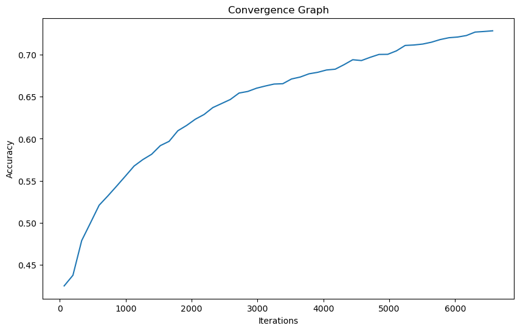

# Parameter Optimization of SVM
Submitted By : Tanishq Singla 
Roll No. : 102003205 
Group : 3COE9 
Subject : UCS654 

## About SVM and Parameter Optimization

SVM, also known as Support Vector Machine, is a widely-used algorithm for both classification and regression tasks in supervised learning. Although SVM can be used for both tasks, it is mainly used for classification in the field of machine learning.

To achieve better accuracy, SVM's crucial parameters like kernel, C, and gamma can be modified. This process is known as Hyperparameter Tuning. The optimization of these parameters can be accomplished using GridSearchCV.

In this Python code, a Fitness Function has been utilized to optimize these parameters.

## Dataset

The dataset for the project has been downloaded from the UCI Machine Learning Repository. 
[https://archive.ics.uci.edu/ml/datasets/Avila#](https://archive.ics.uci.edu/ml/datasets/Avila#)

The Avila data set has been extracted from 800 images of the 'Avila Bible', an XII century giant Latin copy of the Bible. The prediction task consists in associating each pattern to a copyist.

Number of Instances: 10430

Number of Attributes: 11

## Final Result Table

| Sample  | Best Accuracy | Best Kernel | Best C | Best Gamma |
| -----   | ------------- | ----------- | ------- | ------------ |
| 1 | 0.60 | RBF | 7.84 | 8.73 |
| 2 | 0.55 | RBF | 0.83 | 9.05 |
| 3 | 0.70 | RBF | 0.51 | 0.83 |
| 4 | 0.65 | RBF | 1.04 | 4.29 |
| 5 | 0.73 | RBF | 3.16 | 2.23 |
| 6 | 0.49 | RBF | 0.22 | 9.85 |
| 7 | 0.48 | RBF | 0.23 | 9.11 |
| 8 | 0.73 | RBF | 5.24 | 2.17 |
| 9 | 0.69 | RBF | 3.64 | 3.30 |
| 10 | 0.37 | RBF | 1.62 | 0.00 |

## Convergence Graph

## Discussion
The graph is made for the sample which has best accuracy. Sample 5 has the best accuracy of 0.73 having kernel = Rbf, C= 3.16 and Gamma = 2.23.

The convergence graph is a helpful visualization that illustrates the progress of a model during hyperparameter optimization. By plotting the model's accuracy or other evaluation metrics over various iterations, it enables us to observe the model's improvement as it explores different combinations of hyperparameters.

In our situation, the convergence graph displays the maximum accuracy achieved by the model up to a given iteration. This provides insight into how the model's performance evolves during the random search process and when it reaches its peak accuracy.